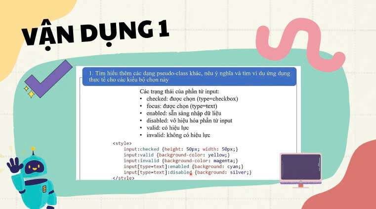
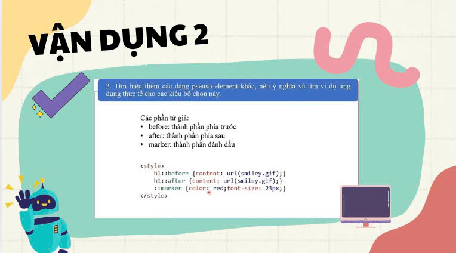

<html>
<head>
  
</head>
<body>

 

 

 

 

 

 

 

 

 

 

 

 

 

 

 
<video width="980" height="572" controls>
  <source src="1.mp4" type="video/mp4">
  Your browser does not support the video tag.
</video>

 

 

 

 

 

 

 

 

 

 

 

 

 

 

 

 

 

 

 

 

 

 
<a href="https://tructamcute.github.io/nhom6_12L/">Quay lại trang chủ</a>
</body>
</html>
